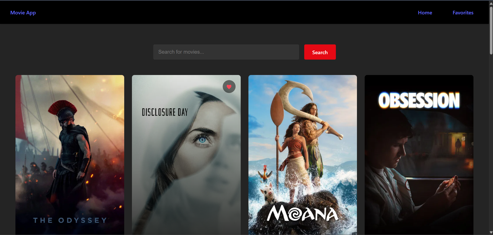

# Movie App

A React movie discovery application that allows users to browse popular movies, search by title, and save favourite movies using the TMDB API.

## Live Demo

[View Live Demo](https://react-movie-app-five-flax.vercel.app)

## Features

- Displays popular movies using the TMDB API.
- Searches for movies by title.
- Shows movie posters, titles, and release years.
- Lets users add and remove favourite movies.
- Saves favourites in browser local storage.
- Includes Home and Favourites pages with React Router.

## Built With

- React
- Vite
- React Router
- TMDB API
- CSS
- Browser Local Storage

## Run Locally

- Clone the repository.
- Open Windows PowerShell.
- Navigate to the project directory.
- Install dependencies: `npm.cmd install`.
- Start the development server: `npm.cmd run dev`.

## Resources
- [TMDB API](https://www.themoviedb.org/)